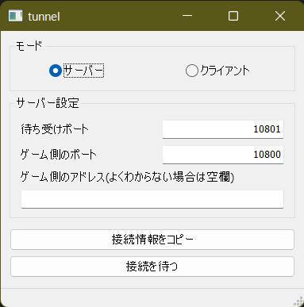
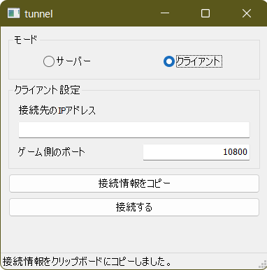

# TH123Tunnel

TH123 といいつつ、たぶん相手のIPアドレス指定して対戦するタイプのゲーム全般で使えるかも。  
花映塚とかメル○ラとか・・・試してないけど。  

# ダウンロード
このページの右の方にあるちっこい Releases ってところを開いて Assets から一番上の zip ファイルをダウンロードしてね。  
**Source code (zip) ってやつはソースコードなので動きません。**  
~~動かせる人は開発に参加してほしい。~~

# 使い方

## """""必読""""

## 共通
ファイアウォールの「受信の規則」設定を適切に許可してあげてください。  
たぶん初回接続時に何か出てくるやつで許可してあげればよいはずなので、接続がうまくいかない場合はファイアウォールの設定が原因かもしれません。  
詳しく書くと別の話になってしまうのでGoogleなどで調べてください。

## サーバーモード

1. 「待ち受けポート」に接続を待ち受けるポート番号を入れる。**ここに入れたポートを開放すること。**
2. 天則でサーバーを立てて、指定したポート番号を「ゲーム側のポート」に入力する。
3. 「接続情報をコピー」を押して自分のIPアドレスをクリップボードにコピーし、対戦相手に伝える。
4. 「接続を待つ」で接続待機開始

## クライアントモード

1. 「接続先のIPアドレス」に対戦相手のIPアドレスを入力する。
2. 「ゲーム側のポート」に、「接続先のIPアドレス」の末尾の「:」以降の数字とは **違う** 番号を入れる。10801など。
3. 「接続する」で接続開始。(この時点では通信は始まらないので焦らなくても大丈夫)
4. 「接続情報をコピー」を押して天則側で「クリップボードのIPでサーバーに接続」を選び、対戦を開始する。

## 設定項目詳細

読まなくてもいい。

### サーバーモード
- 待ち受けポート  
**このツールで** 待ち受けるポート番号を指定する。  
天則のポートではない。  
**天則のポートではない。**

- ゲーム側のポート  
**天則の**ポートを指定する。  
10800で建ててたら10800と入力する。  
「待ち受けポート」と同じにするとエラーになると思う。

- ゲーム側のアドレス  
普通に使う分には空欄でOK。  
このツールで受けた通信を別のリモートクライアントに転送したりすることが出来るので、要するにうまく設定すると通信の中継ができる。  
なんらかの大会の運営者がクラ専同士を繋いだりするとかにもしかしたら使えるかもしれない。  
要望があれば中継モードをきちんと作る・・・かも。

- 接続情報をコピー  
あなたのパソコンのIPアドレスをクリップボードにコピーする。  
それをそのまま相手に伝えてあげてください。

- 接続を待つ  
相手からの接続を待つ。
もう一度押すと接続待ちを解除する。  
なんか繋がらないなとなったときは一度接続待ちを解除してから接続待ちし直すと直るかもしれない。  
(もし本当に動かない場合は報告お願いします、報告テンプレみたいなのはそのうち用意する)

### クライアントモード

- 接続先のIPアドレス  
接続先のIPアドレス。ちなみにIPv4でもIPv6でもどっちでも行ける。  
何ならドメイン名でも行けるはず。(example.comみたいなやつ)  

- ゲーム側のポート  
天則からの通信を受け付けるポートと思ってもらえばよい。  
技術的な話をすれば、天則は 127.0.0.1 (ループバックアドレス) に接続してくるので、その通信を待ち受けるためのポートを指定する必要がある。

- 接続情報をコピー  
クライアントモードでは、天則の「クリップボードのIPでサーバーに接続」を利用するためにクリップボードにIPアドレスを転送するボタンとして働く。  
余談だけど天則のこの「クリップボードのIPでサーバーに接続」ってかなり面白い発明だと思う。

- 接続する  
「接続する」といいつつ、やっているのは天則からの通信の待ち受けの開始なので、実は動きとしてはサーバー。  
天則からの通信が入ると、それをそのまままるごとこのツールを介してパケットをリモートに転送する。  

